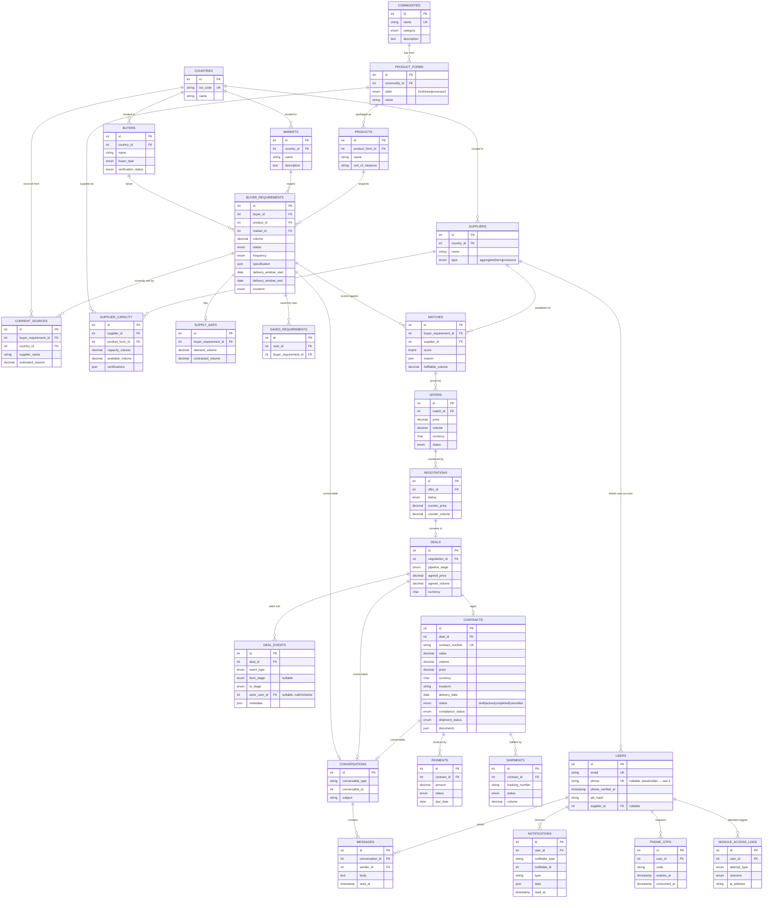

# NCDEP — Market Intelligence and Exchange (MIE) module

Laravel 13 API backend for the Market Intelligence and Exchange module, built section-by-section
against `ncdep-market-intelligence-exchange-task.md`. This README is Section 5 item 5's technical
deliverable: architecture rationale, the data model, how to run it, and an honest accounting of
what's built versus what's aliased, simplified, or not attempted.

---

## 1. Architecture Decisions

### Two-repo split, Sanctum SPA session auth

This repository (`ncdep-mie`) is the API only. The UI is a separate repository,
`ncdep-mie-frontend` (Vue 3 SPA), not included in this deliverable. The two talk over Sanctum's
**stateful SPA** session auth, not token-based (Bearer/API-token) auth.

That choice follows directly from the shape of the two repos: this is a first-party SPA — one
frontend, one team, one deploy unit conceptually — not a public API serving arbitrary third-party
clients. Sanctum's stateful mode gets first-party cookie-session auth (CSRF-protected, no token to
store client-side, natural logout-everywhere) for exactly that case, and costs nothing extra
because both apps sit in the same origin family in dev (`APP_URL=http://localhost`,
`SANCTUM_STATEFUL_DOMAINS=localhost:5173` — Vite's default dev port) and would sit under the same
parent domain in any real deployment. Token auth is the right call when the API has consumers
Sanctum's session model doesn't fit (native mobile, third-party integrations); neither applies
here. `bootstrap/app.php` wires this with a single `$middleware->statefulApi()` call.

One direct consequence: every module route in `routes/api.php` sits behind `auth:sanctum`, and the
module-specific `module.access` / `module.access.fresh-pin` middleware described below runs *on
top of* that, never instead of it.

### Section 1.1's access gate — PIN once per session, re-verified fresh at commitment points

`EnsureModuleAccessGranted` gates every module route behind phone OTP + PIN, required **once per
session**, checked on first entry. It is deliberately not re-checked on every request: re-verifying
on every click adds friction with no real security benefit for read/browse actions (viewing the
command center, market scan, a buyer profile). Session policy is stored as flags
(`module_access.phone_verified_at`, `module_access.granted_at`, and the PIN-recency timestamp
below) rather than re-running OTP/PIN logic per request.

The one place this module *does* re-prompt is the two points where the user is making a financial
or legal commitment: **offer submission** (`POST /requirements/{id}/offer`, Section 3.4) and
**contract creation** (`POST /deals/{id}/contract`, Section 3.11). Both sit behind a second
middleware, `RequiresFreshPin`, which requires the PIN to have been verified within a short
recency window (`module_access.fresh_pin_window_minutes`, default 5 minutes) rather than requiring
re-entry on literally every request to those two routes. A user submitting several offers in one
sitting isn't re-prompted for every single one; a PIN verified an hour ago, or on a session left
unattended, no longer counts as confirming *this specific* commitment. Both window lengths (module
entry vs. fresh-PIN) are config values (`config/module_access.php`), not hardcoded, so the
friction/risk tradeoff can be tuned per environment without touching code.

### Section 2's chain integrity — FK rules by data category, not one blanket rule

Every entity from `buyer_requirements` downward carries a required (non-nullable) foreign key to
its parent — there is no orphaned match, offer, negotiation, deal, or contract anywhere in the
schema. On top of that, delete behavior is chosen per category, not applied uniformly:

- **Restrict on delete** for anything financial/contractual, or a shared reference row that other
  live rows still point to: `contracts.deal_id`, `payments.contract_id`, `shipments.contract_id`,
  and every FK to `countries` / `products` / `markets` / `product_forms` / `suppliers` (e.g.
  `buyer_requirements.product_id`, `buyer_requirements.market_id`,
  `supplier_capacity.product_form_id`). You cannot delete a country, product, or supplier out from
  under a contract that references it, and a contract can't vanish out from under its deal.
- **Cascade on delete** for dependent records that only make sense attached to their parent and
  have no independent value once it's gone: `messages.conversation_id`,
  `buyer_requirements.buyer_id`, `matches.buyer_requirement_id`, `offers.match_id`,
  `negotiations.offer_id`, `deals.negotiation_id`, `supply_gaps.buyer_requirement_id`,
  `supplier_capacity.supplier_id`, `deal_events.deal_id`, `phone_otps.user_id`,
  `notifications.user_id`, `saved_requirements.*`.
- **Null on delete** specifically for `deal_events.actor_user_id`. A deal's `deal_events` audit
  trail belongs to the deal, not to whichever user happened to trigger each row, and can span many
  different actors over its lifetime — deleting a user account should lose the attribution on that
  row, not erase the deal's history. This is deliberately different from `module_access_logs`,
  which cascades on user delete, because that log is inherently per-user in a way a deal's
  timeline is not.

### Section 3.11's non-negotiable chain rule — two enforcement points, both tested

The chain **Requirement → Match → Negotiation → Offer → Deal → Contract** cannot be short-circuited
from either end. This is enforced at two separate guard-clause points, not just implied by the
schema's foreign keys:

1. **`RequirementController::offer()`** — an offer can only be created against an existing `Match`
   for that requirement. No match, no offer: a clear `422` response, not a silently created
   placeholder match.
2. **`ContractController::store()`** — a contract can only be created once its deal's
   `pipeline_stage` is `contract_pending`. Any other stage returns `422 deal_not_contract_pending`
   with the deal's actual current stage in the response, so the caller can see exactly why.

Both paths are covered by feature tests asserting the rejection (not just the happy path) — see
`tests/Feature` for the relevant controllers.

### Scoring engines (3.16, 3.17) — weighted composites with proportional renormalization

Both the AI Match Score (`MatchScorer`, Section 3.16 — one supplier candidate against one
requirement) and the Opportunity Score (`OpportunityScorer`, Section 3.17 — a requirement assessed
as a market opportunity, no specific supplier) are weighted composites of several named
components, each producing a value in `[0, 100]` or `null` when there's genuinely no data to
compute it. Weights live in `config/mie_scoring.php`, with a one-line rationale comment per
component — never inline magic numbers.

The renormalization rule, implemented once in `WeightedScorer` and shared by both engines: a
component that's `null` is **excluded entirely** — its configured weight isn't spent and doesn't
count against the score — and the weights of the components that *do* have data are scaled up
proportionally (`presentWeight ÷ sum(presentWeights)`) so they still sum to the full score. A
missing component never drags the score down as an implicit zero, and the relative importance
between whichever components *are* present stays exactly what `config/mie_scoring.php` says it
should be, even when others drop out. The response's `breakdown` array exposes this directly —
every component shows its raw value, configured weight, the renormalized weight actually used, and
its contribution — so a `null` component is visibly excluded rather than silently treated as zero.

---

## 2. Data Model Diagram

Grouped by domain. Logistics (`current_sources`, `shipments`) and the full Intelligence/User
domains are only partially represented — see [Section 4](#4-known-gaps-vs-spec) for what's
aliased or missing in each.



---

## 3. How to Run

Assumes a clean machine with Docker, PHP 8.3+, and Composer already installed.

```bash
# 1. Start MySQL in Docker (matches this repo's .env exactly)
docker run --name ncdep-mie-mysql -d \
  -e MYSQL_ROOT_PASSWORD=secret \
  -e MYSQL_DATABASE=ncdep_mie \
  -p 3306:3306 \
  mysql:8

# 2. Clone and install
git clone <repo-url> ncdep-mie && cd ncdep-mie
composer install

# 3. Environment
cp .env.example .env
php artisan key:generate
# Confirm .env has:
#   DB_CONNECTION=mysql
#   DB_HOST=127.0.0.1
#   DB_PORT=3306
#   DB_DATABASE=ncdep_mie
#   DB_USERNAME=root
#   DB_PASSWORD=secret
#   SANCTUM_STATEFUL_DOMAINS=localhost:5173

# 4. Migrate + seed
php artisan migrate:fresh --seed

# 5. Serve
php artisan serve
# API now at http://localhost:8000

# 6. Run the end-to-end demo walkthrough (Section 4's acceptance scenario, real data, real
#    controllers/middleware — see the command's own doc-comment for why it isn't a raw HTTP
#    round-trip)
php artisan mie:demo-walkthrough

# 7. Run the test suite (isolated SQLite in-memory DB per phpunit.xml, doesn't touch MySQL)
php artisan test
```

The seeded demo user is `demo@ncdep-mie.test`, PIN `1234`, linked to the "Rift Valley Hibiscus
Growers Ltd" supplier — that's the user `mie:demo-walkthrough` drives.

Re-running `php artisan db:seed` (without `migrate:fresh`) is safe: all reference/lookup data
(`countries`, `commodities`, `product_forms`, `products`, `markets`) is created via
`firstOrCreate()` on natural keys, so reseeding doesn't create duplicates or grow row counts — this
was verified directly (three consecutive `db:seed` runs, identical row counts across every seeded
table).

**The Vue 3 SPA (`ncdep-mie-frontend`) is a separate repository and is not part of this
deliverable.** No frontend code, build tooling, or dev-server instructions are included here.

---

## 4. Known Gaps vs. Spec

### Deliberately out of scope (never attempted)

- **Section 3.6 (Regions)** — no region entity above `countries` exists in the schema; not in
  Section 5's minimum deliverable list.
- **Section 3.7 (RFQs as a distinct entity)** — no dedicated RFQ table or workflow was built;
  `buyer_requirements` is the closest concept (see the "Active RFQs" alias below).
- **Section 3.8 / 3.9 (logistics infrastructure — ports, routes, freight)** — nothing beyond
  `current_sources`' minimal country + estimated-volume fields exists; no ports/routes/freight
  tables anywhere.
- **Section 3.14 (real-time delivery — websockets/broadcasting)** — every endpoint in this build is
  request/response only; nothing pushes.
- **Section 3.18 (Market Watch — followed markets, price watchlists)** — no "follow" or
  "watchlist" concept exists in the schema; the dashboard's `my_market` section returns these as
  explicit empty arrays with a note, not a placeholder feature.
- **Sections 3.19 / 3.21 / 3.22** — not in Section 5's minimum deliverable list; not attempted.
- **Price history / shipment delay tracking** — `shipments` records a single current
  `status`/`departure_date`/`arrival_date`, not a historical log of status changes or delay events.
- **Payment processing** — `payments` is a record-keeping table only (amount, status, due date); no
  gateway integration, no money actually moves. This is explicitly out of scope per the spec
  itself, not a build choice.

### Honest aliases (built, but standing in for something not fully modeled)

- **"Active RFQs" = open `buyer_requirements`.** No distinct RFQ entity exists; anywhere the spec
  says "RFQ," this build surfaces `buyer_requirements` with `status = open`.
- **"Market relationships" = operating `markets`.** `markets` (country + name/description) is the
  only market-relationship concept in the schema — there's no separate buyer↔market relationship
  table tracking history or strength.
- **"Offers/counteroffers" contract view = negotiations without a deal.** `ContractController`'s
  `offers_counteroffers` view surfaces `negotiations` that haven't converted to a `deal` yet —
  there's no contract row at that stage (a contract, by definition, doesn't exist there), and no
  distinct "counteroffer" entity separate from `negotiations`.
- **Sustainability indicators = always null.** No sustainability field exists anywhere in the
  schema; every response that would carry one returns `null` with an explanatory note rather than a
  fabricated score.

### Real stubs/simplifications (computed, not faked, but simplified)

- **`spec_compliance` (match score) is form-level only.** Candidates are already filtered to the
  requirement's exact `product_form_id` before scoring, so this component is always 100 in practice
  today — a true grade/moisture/packaging-level comparison would need per-supplier spec data that
  doesn't exist in this schema. Certification-level comparison (which *is* real per-supplier data)
  is handled separately by the `user_capability` / `compliance_fit` components.
- **`logistics_feasibility` is a country-pair precedent proxy**, shared verbatim between the match
  and opportunity scorers: it checks whether a `current_sources` row already exists for that
  market/supplier country pair (scores 100) or not (scores 50, neutral — "never recorded" isn't
  proof of "infeasible"). This stands in for the ports/routes/freight data Section 2 lists but this
  build never populated.
- **`price_fit` (match) and `price` (opportunity) are usually `null`.** No supplier states an
  asking price ahead of an offer anywhere in this schema, so there's no per-candidate price signal
  to compare at match time; `price` at the opportunity level only reflects *whether* a priced offer
  already exists, not whether the price is favorable (no market-price benchmark exists to compare
  against). Both are genuinely excluded via `WeightedScorer`'s renormalization, not defaulted to 0.
- **Contract `draft → active` has no transition endpoint.** No route or controller action moves a
  contract out of `draft` — contracts are always created as `draft`
  (`ContractController::store()`), and nothing in this build ever changes that status via the API.
  Stage 8's seeder created one `Contract` directly at `active` via a factory call, bypassing the
  (nonexistent) API path, specifically so at least one seeded contract demonstrates that status.

### Known technical debt / stated design decisions

- **Dashboard `my_deals`/`my_money`/`my_supply` scope by linked supplier, not individual user.**
  `users.supplier_id` is the only link from a user to commerce data (deals/contracts connect to a
  supplier via `match`, never directly to a user) — two users linked to the same supplier see
  identical dashboards. Acceptable for this build since every seeded/demo user maps to exactly one
  supplier, but it's a real limitation if a supplier organization ever has multiple named users.
- **The Sanctum session gate requires the configured SPA origin.** A bearer-token-only client
  (mobile app, third-party integration) wouldn't currently get session-backed `module_access.*`
  gate state — the whole gate is designed around the one first-party SPA this module actually has.
- **`mie:notify-expiring-contracts` exists but isn't wired into a scheduler.** The command itself
  (`app/Console/Commands/NotifyExpiringContracts.php`) is real and runnable on demand; the one-line
  `Schedule::command(...)->daily()` addition to `routes/console.php` was deliberately not made,
  since this dev setup has no persistent cron process to run it.
- **`POST /requirements/{id}/match` is intentionally not idempotent.** Re-running it against the
  same requirement creates additional `matches` rows rather than being a no-op — this is correct
  behavior for a real user re-running the match tool (supplier capacity may have changed since the
  last run), not a bug. Only the *seeder's* reference data needed strict idempotency; a live
  matching action does not.
- **Dashboard's `my_supply`/`my_documents` still describe `certifications` as nonexistent.**
  `DashboardController::mySupply()` / `myDocuments()` hardcode `'certifications' => null` with a
  note stating no certifications field exists on `suppliers`/`supplier_capacity` — that note is now
  stale. `supplier_capacity.certifications` was added in a later stage (needed for the match/
  opportunity scorers' `user_capability`/`compliance_fit` components) but the dashboard was never
  updated to actually read it. Flagged here rather than silently corrected, since fixing it wasn't
  requested and is outside this README's scope.
- **Section 3.20 (Market Intelligence Reports) is the one Section 4 acceptance-scenario step that
  cannot be demonstrated.** No report-generation endpoint exists anywhere in this build at any
  stage. `mie:demo-walkthrough` states this explicitly at the relevant step rather than skipping it
  silently or inventing an endpoint to paper over it.

---

## 5. Extensibility Note

**Can a new commodity, country, or buyer be added without a schema change? Yes.** All four —
countries, commodities (with their product forms and products), markets, and buyers — are pure
data: rows in existing tables, inserted the same way the seeder does it
(`Country::firstOrCreate(['iso_code' => 'XYZ'], [...])`, `Commodity::firstOrCreate(['name' =>
'...'], [...])`, and so on). `database/seeders/Mie/ReferenceDataSeeder.php` demonstrates this exact
pattern for the four countries, one commodity/three product-forms/three products, and two markets
it seeds — adding a fifth country or a second commodity is the same call shape, no migration
involved. A new supplier certification is likewise just a new string inside the
`supplier_capacity.certifications` JSON array — nothing about the schema constrains which
certification names are valid.

What **would** require a schema change: a genuinely new deal pipeline stage. `pipeline_stage` is a
DB-level `enum` column (`DealPipelineStage` cases), and `DealStageTransitioner::TRANSITIONS` is an
explicit map keyed on those same values — adding a stage means a migration to extend the enum
*and* a code change to `TRANSITIONS` to say where the new stage fits in the forward path. Same
story for any new contract/offer/negotiation status, or a genuinely new top-level entity (an RFQ
table distinct from `buyer_requirements`, a ports/routes table for real logistics feasibility,
etc.) — those are structural gaps listed in Section 4, not data that can be added through
`firstOrCreate()` alone.
